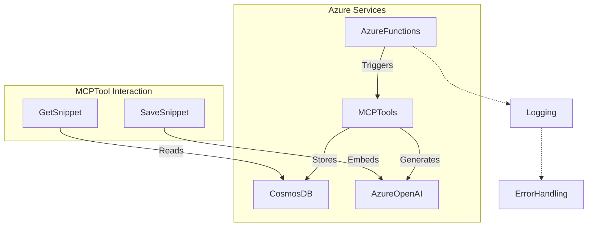
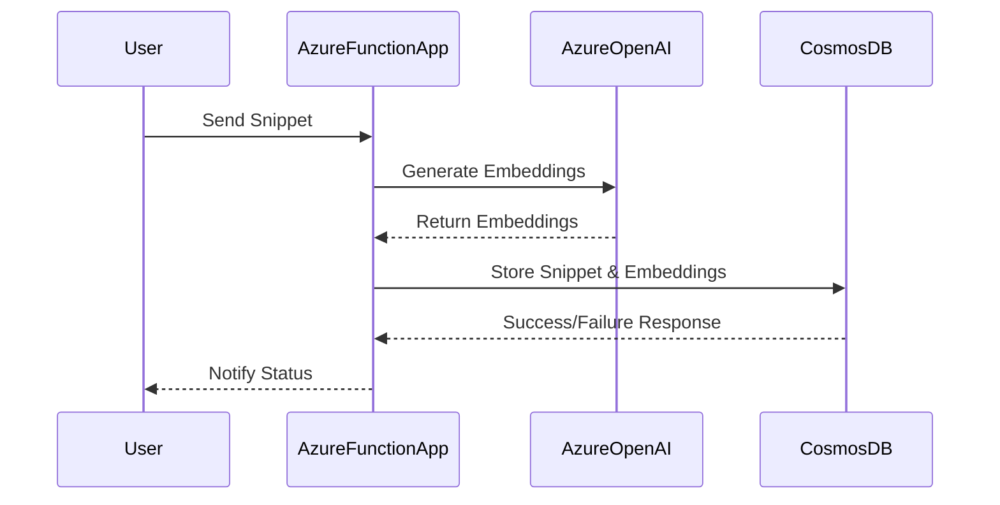
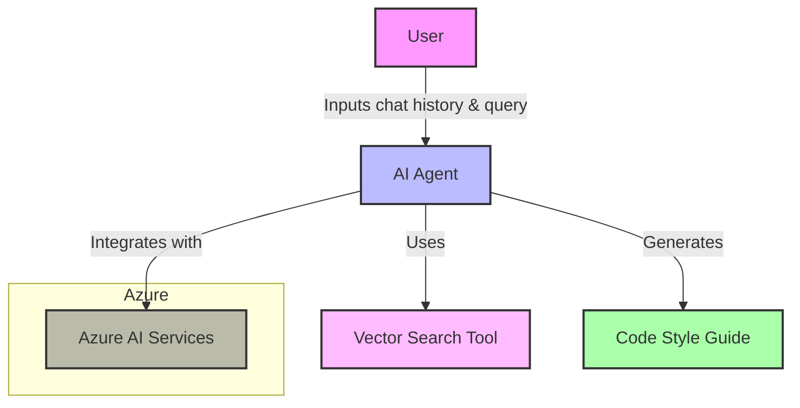
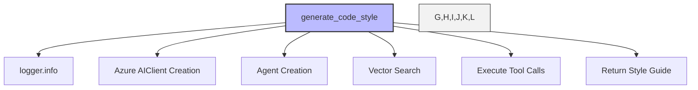
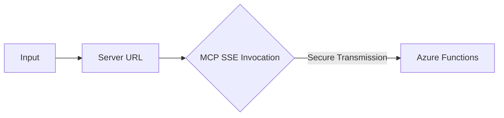

# Project Overview

This project is centered around the MCP (Model Context Protocol) tools designed for use with Azure Functions and AI-powered operations. The tools enable seamless integration with Azure OpenAI, Cosmos DB, and AI Agents to manage and analyze code snippets. Key functionalities include document management, vector search, error handling, logging, and provisioned cloud infrastructure using Bicep templates.

## Major Concepts

### MCP Tools

MCP tools automate operations related to code snippets using triggers that respond to Azure Function events. Tools such as `save_snippet`, `get_snippet`, `deep_wiki`, and `code_style` interact with various Azure services to provide a robust solution for code documentation and analysis.

### Azure Functions

Azure Functions provide the backbone for serverless execution, handling multiple types of triggers including HTTP and custom MCP triggers. The project leverages Azure Functions to perform backend operations with minimal infrastructure overhead.

### Cosmos DB & Vector Search

Cosmos DB is employed for document storage, utilizing its ability to handle JSON data. The integration includes vector search capabilities to enhance the retrieval process using embeddings generated by Azure OpenAI.

### Azure OpenAI

The project uses Azure OpenAI for advanced AI operations, particularly embedding text for vector-based searches and analysis. This enables intelligent handling and querying of code snippets.

### Error Handling & Logging

Error handling in the project is robust, utilizing Python's exception handling capabilities. Logging is crucial for diagnostics and is employed throughout the code to track operations and errors.

### Bicep Templates

Azure Bicep is used to define infrastructure as code, setting up Azure resources required for the operation of MCP tools. This involves complex parameter definitions and resource orchestration.

## Diagram Visualizations

### System Architecture



### Data Flow



## Snippet Catalog

| Snippet ID               | Language    | Purpose                                           |
|--------------------------|-------------|---------------------------------------------------|
| snip-func                | Python      | MCP tool trigger for saving snippets              |
| func-app-snippy          | Python      | Demonstrates Azure Functions with multiple services|
| main-bicep               | Bicep       | Infrastructure as code for Azure provisioning     |
| test-snippet-default-project | Python  | Simple print function                             |
| complex-snippet-default  | Python      | Basic Calculator class                            |

## Walkthroughs

### Saving a Snippet

1. **Send HTTP Request**: Utilize Azure Function to POST a code snippet.
   - Include required fields such as name and code.
2. **Generate Embeddings**: Azure OpenAI generates vector embeddings from code.
3. **Store in CosmosDB**: Snippet and embeddings are stored as a document.
4. **Logging & Error Handling**: Any errors during the procedure are logged and conveyed back to the user.

### Provisioning Resources

1. **Define Configuration**: Use Bicep templates to specify parameters and resources.
2. **Deploy Resources**: Execute the Bicep script to allocate Azure resources.
3. **Output Configuration**: Retrieve necessary configuration values post-deployment.

## Best Practices

- Ensure all Azure Function triggers are well-defined to avoid unexpected invocation issues.
- Use robust error handling to manage unforeseen runtime exceptions.
- Structure logging to capture crucial operational details for later analysis.
- Secure Bicep templates to prevent exposure of sensitive data and secrets.

## Anti-patterns

- Avoid hardcoding API keys in the code; use secure environment variables instead.
- Do not neglect validation of user input, which can lead to errors in processing.

## Open TODOs

- Implement a more granular logging system for detailed telemetry.
- Enhance support for additional programming languages beyond Python.
- Expand the capabilities of vector search to support more complex queries.

## Further Reading

- [Azure Functions Documentation](https://docs.microsoft.com/en-us/azure/azure-functions/functions-reference)
- [Cosmos DB Documentation](https://docs.microsoft.com/en-us/azure/cosmos-db/introduction)
- [Azure Bicep Documentation](https://docs.microsoft.com/en-us/azure/azure-resource-manager/bicep)
- [Azure OpenAI Documentation](https://docs.microsoft.com/en-us/azure/cognitive-services/openai/overview)

This documentation provides a comprehensive overview of the MCP tools project, detailing its architecture, functionality, and best practices.

# Project Wiki

This document serves as a comprehensive guide to the project based on the saved code snippets. It covers the main components, design patterns, error handling, and other programming practices utilized within the system.

## Project Overview

The project appears to be centered around generating code style guides using AI agents. The system leverages Azure's AI Agents service to facilitate this, incorporating advanced tools like vector searches to refine the outputs based on real code patterns.

The main functionality showcased involves creating an AI agent to synthesize a code style guide. Here's a look at the critical aspects of this implementation.

## Concepts and Patterns

### 1. AI Agent and Azure Integration
- **AI Agents Service**: Uses an AI agent with a specific personality (`CodeStyleSynthesizer`) to generate code style guides.
- **Azure Authentication**: Utilizes Azure's DefaultAzureCredential for secure connections and interactions with Azure services.

### 2. Vector Search Tool
- **Purpose**: Employed by the agent to find relevant code examples that inform the style guide creation.

### 3. Logging and Debugging
- **Logging**: Extensive use of logging to record input parameters, system prompts, and service interactions for transparency and debugging.
- **Error Handling**: Custom error messages and exception logging help diagnose and recover from service failures.

### 4. Asynchronous Execution
- The system is designed using async functions to manage connections and operations efficiently, ensuring non-blocking execution.

### 5. Tool and Function Execution Lifecycle
- **Tool Calls**: The agent can call tools (like vector search) as needed, handling multiple tool calls and collecting their outputs to refine its responses.

## Mermaid Diagrams

### System Architecture


### Call Graph


## Snippet Catalog

| Snippet ID            | Language | Purpose                                    |
|-----------------------|----------|--------------------------------------------|
| ai-agents-service-usage | Python   | Generates a code style guide using an AI agent |

## Walkthrough: Generating a Code Style Guide

1. **Input Preparation**:
   - Collect the necessary chat history and user queries.
   
2. **Agent Initialization**:
   - The system authenticates with Azure and initializes the AI agent using specified personality traits.

3. **Processing**:
   - The agent uses the chat history and query to guide the style guide generation.
   - It performs vector searches to gather relevant code patterns, refining its output.

4. **Tool Execution**:
   - Throughout its run, the agent may call various tools. It monitors these calls, collects outputs, and integrates the results into the style guide.
   
5. **Output**:
   - The agent returns a comprehensive code style guide formatted in Markdown.

## Best Practices and Anti-Patterns

### Best Practices
- **Robust Logging**: Ensures transparency and ease of debugging.
- **Asynchronous Operations**: Enable smooth, non-blocking tasks execution.
- **Secure Connects**: Use of Azure's credentials management for secure integrations.

### Anti-Patterns
- **Error Handling**: Limited error recovery strategies; mainly logs and raises exceptions when failures occur.

## Open TODOs
- Additional error handling techniques to gracefully recover from failures should be implemented.
- Expand the test suite to cover edge cases and integrate various query types.

## Further Reading

- [Asynchronous Programming in Python](https://docs.python.org/3/library/asyncio.html) - Explore async patterns
- [Azure AI Services Documentation](https://azure.microsoft.com/en-us/services/cognitive-services/) - Learn about integrating Azure AI
- [Logging in Python](https://docs.python.org/3/library/logging.html) - Effective logging strategies in Python applications

# Deep Wiki Documentation

## Project Overview

This project primarily deals with integrating Azure Functions with Managed Control Plane (MCP) extensions. The focus is on configuring secure communication with Azure services through system keys and dynamically generating URLs based on user input. This documentation provides a deep dive into the various components and code snippets used in the project.

## Key Concepts and Components

### Inputs and Parameters
- The `inputs` object in the code snippets includes `promptString` parameters, which are designed to securely accept user input. 
  - `functions-mcp-extension-system-key`: This represents the key for authenticating Azure Functions extensions; it is secured as a password.
  - `functionapp-name`: This refers to the name of the Azure Functions App and is used to dynamically construct URLs.

### Server Configuration
- The `servers` object describes server settings, with `remote-snippy` for connecting to Azure's SSE and `local-snippy` (commented out for potential local testing).
- URLs are formed using the `functionapp-name`, a best practice for ensuring flexibility across different deployments.
- The server communication uses the SSE (Server-Sent Events) protocol to maintain a connection, allowing continuous data flow between client and server.

### Deployment and Security
- The snippets include dynamic URL construction and the use of system keys to ensure authentication.
- TODOs could potentially include configuring and enabling `local-snippy` for local development, which is commented out in the provided snippets.

## Mermaid Diagrams

### System Architecture

```mermaid
graph TD
    A[User Input] -->|promptString| B{Inputs}
    B -->|functionapp-name| C[URL Generation]
    C --> D[Azure Server]
    D -->|SSE| E{Data Flow}
    E -->|Authenticated| D
    D ->|X-Functions-Key| B
```

### Data Flow



## Snippet Catalog

| Snippet ID            | Language | Purpose                                            |
|-----------------------|----------|----------------------------------------------------|
| my-cloud-mcp-test     | JSON     | Configures secure server communication with Azure  |
| ai-agents-service-usage| JSON     | Sets up Azure Functions and MCP extension systems  |

## End-to-End Walkthrough

1. **Input Configuration:**
   - Define the Azure Functions system key and app name.
   - Ensure inputs are correctly set up to capture secure data.

2. **Server Setup:**
   - Configure the `servers` object with the appropriate URLs.
   - Use the system key for authentication.

3. **Deployment:**
   - Deploy the configuration to Azure Functions.
   - Monitor the SSE connection to confirm continuous data flow.

## Best Practices

- **Security:** Always secure system keys and never expose them in client-side code.
- **Dynamic URL:** Utilize parameter-driven URL generation to easily adapt to different environments.
- **Version Control:** Comment out local server configurations when deploying to production to maintain clear separation between development and production environments.

## Anti-Patterns

- **Hardcoding Sensitive Information:** Avoid embedding system keys or other sensitive information directly in code. Always use environment variables or secure inputs.
- **Disabled Local Development:** Actively maintain and test local configurations to ensure they work in tandem with production setups.

## Open TODOs

- Enable and test the `local-snippy` configuration to facilitate local testing.
- Implement error handling for connection failures or server response issues.

## Further Reading

- [Azure Functions Documentation](https://docs.microsoft.com/en-us/azure/azure-functions/)
- [Server-Sent Events (SSE) Overview](https://developer.mozilla.org/en-US/docs/Web/API/Server-sent_events)
- [Best Practices for Secure Configuration](https://owasp.org/www-project-cheat-sheets/cheatsheets/Configuration_Security_Cheat_Sheet)

**Note:** Save this content in `deep-wiki.md` in the root of your project folder for reference and documentation.